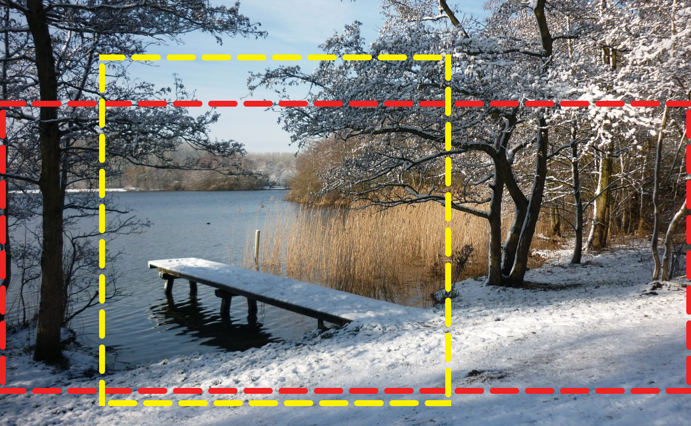

## Adapter la direction artistique

Que faire quand une image, par son ratio ou son cadrage, n’est plus adaptée à la taille du viewport ?

Il y a donc un changement de direction artistique en fonction de la taille du viewport. <!-- {.fragment} -->

Cela comprend tout changement de : <!-- {.fragment} -->
- ratio <!-- {li:.fragment} -->
- cadrage <!-- {li:.fragment} -->
- contenu <!-- {li:.fragment} -->

===

 <!-- {style="width:25rem"} -->

- recadrer une photo sur l’élément principal
- passer d’un format type bannière à un format plus carré

===

### Picture

C’est le rôle de l’élément `<picture>`.

Il sert à enrichir une image de sources alternatives en fonction de media-queries.

```html
<picture>
  <source srcset="img-400x200.jpg" media="(min-width: 50em)" />
  
</picture>
```

Chaque `<source>` a son propre attribut `srcset`.

`<picture>` est un élément intangible, il n’est pas destiné à être stylé,  
ce n’est pas un conteneur.<!-- {p:.alert.alert_warning} --> 

???

`<source>` était déjà présent dans HTML 5 pour accompagner `<audio>` et `<video>`.

On parle souvent de media-queries relatives à la taille du viewport mais ça peut aussi être relatif au nombre de couleurs ou plus récemment au « mode sombre »

===

