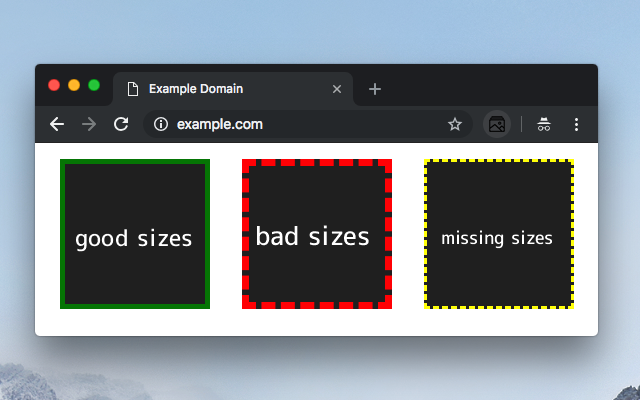

## Problèmes et solutions

Lors de la mise en place des images responsive, on se heurte à différentes difficultés.

Les outils actuels pour déboguer `<picture>`, `srcset` et `sizes` sont rares.

===

### Comment déboguer les `sizes` ?

Redimensionner l’écran et, à chaque pixel, comparer la taille calculée dans `sizes` pour la media-query courante avec la taille réelle affichée.

J’ai codé une petite web-extension pour faciliter ça : [@ryuran/sizes-webextension](https://github.com/ryuran/sizes-webextension) <!-- {p:.fragment} -->

 <!-- {.fragment style="width:18rem"} -->

???

Comment ça « fastidieux » ?

compatible chrome et firefox

===

### Comment choisir les variantes ?

On conseille `5` variantes maximum d’images par source.

Pour choisir ces formats, le mieux est de croiser avec les statistiques du site en fonction des tailles de viewport des utilisateurs.

Nicolas Hoizey ([@nhoizey](https://twitter.com/nhoizey)) et moi-même travaillons sur un outil capable de conseiller __les formats d’image les plus pertinents__ pour un `` __en fonction de statistiques__ extraites de Google Analytics : [@cleverage/responsive-image-widths](https://github.com/cleverage/responsive-image-widths)

Aidez-nous !

===

### Comment générer ces variantes ?

Il existe des plugins pour la plupart des CMS pour générer des images de différentes tailles et formats à partir d’une source de bonne qualité.

De nombreux services de CDN proposent de générer des variantes d’image à la volée :
- [Cloudinary](https://cloudinary.com/)
- [Imgix](https://www.imgix.com/)
- [TwicPics](https://www.twicpics.com/)
- [Imageresizer.io](https://imageresizer.io/)
- etc.

???

une fois générées une première fois elle reste en cache sur les CDN

===

### Comment stocker ces images ?

Avant, nous avions 1 image sur le serveur.

Mais si on multiplie par ces 5 variantes, puis par 2 pour les formats `webp` :
- 10 images <!-- {li:.fragment} -->
- Ce qui fait un poids considérable <!-- {li:.fragment} -->
- Surtout si on multiplie par le nombre d’images du site <!-- {li:.fragment} -->

Le coût du stockage non-négligeable est à prendre en compte pour comparer avec  
les tarifs des services cités précédemment. <!-- {p:.alert.alert_info.fragment} -->

===

### `srcset` mais pour CSS, c’est possible ?

__Actuellement non__, ou en tous cas pas standardisé et pas avec un bon support.

Un article de Chris Coyier sur le sujet : [Responsive Images in CSS](https://css-tricks.com/responsive-images-css/)

Le plus souvent, même une image dite de `background` est __un choix éditorial plus que décoratif__, car elle a un __sens relatif au contenu__ plus qu’au contexte d’affichage.  
Elle est même __souvent contribuée__ (au choix du rédacteur).

Donc ce devrait être un `` dans le html.

===
